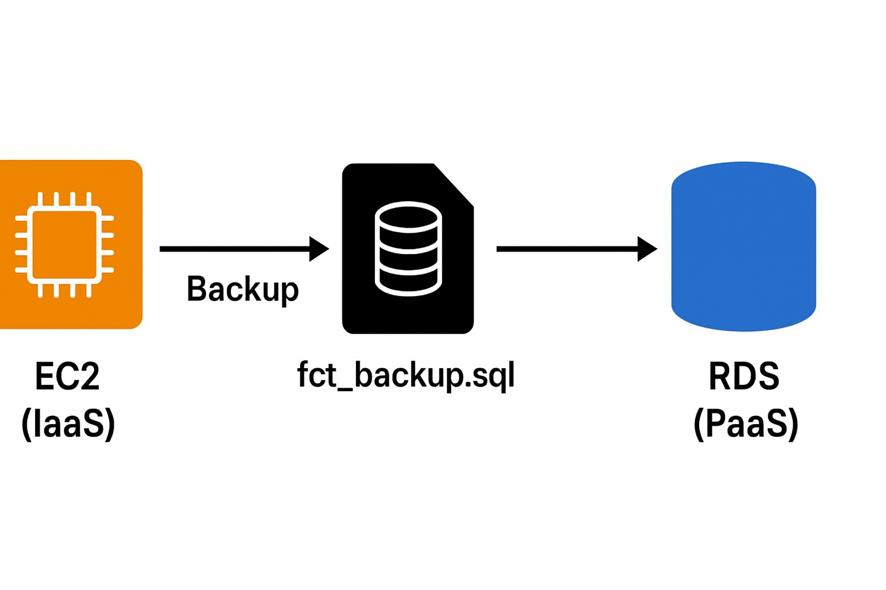

# AWS Cloud Database Modernization: IaaS to PaaS Migration

## 📌 Project Overview
This project demonstrates the migration of a MySQL database hosted on an **EC2 Instance (IaaS)** to **Amazon RDS (PaaS)**.  
We take an existing database (`fct`) with a `studentInfo` table, export it using `mysqldump`, and restore it into the `rdsdb` database hosted on Amazon RDS.

---

## 🏗 Architecture


---

## ⚙️ Steps & Commands

### **1️⃣ Create Database on EC2 (IaaS)**
```bash
# SSH into EC2
ssh -i your-key.pem ec2-user@<EC2_PUBLIC_IP>

# Login to MySQL
mysql -u root -p

# Create database and table
CREATE DATABASE fct;
USE fct;

CREATE TABLE studentInfo (
    SR_no INT PRIMARY KEY,
    NAME VARCHAR(50),
    Crouse VARCHAR(50)
);

# Insert sample records
INSERT INTO studentInfo VALUES (101, 'tejal', 'aws');
INSERT INTO studentInfo VALUES (102, 'ishwar', 'java');
INSERT INTO studentInfo VALUES (103, 'isha', 'aws');

# Verify data
SELECT * FROM studentInfo;

### **1️⃣ Export Database from EC2**
```bash
mysqldump -u root -p fct > fct_backup.sql

